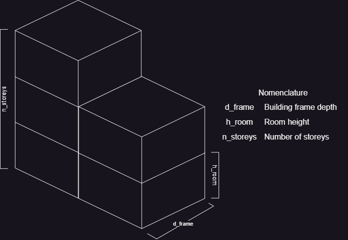
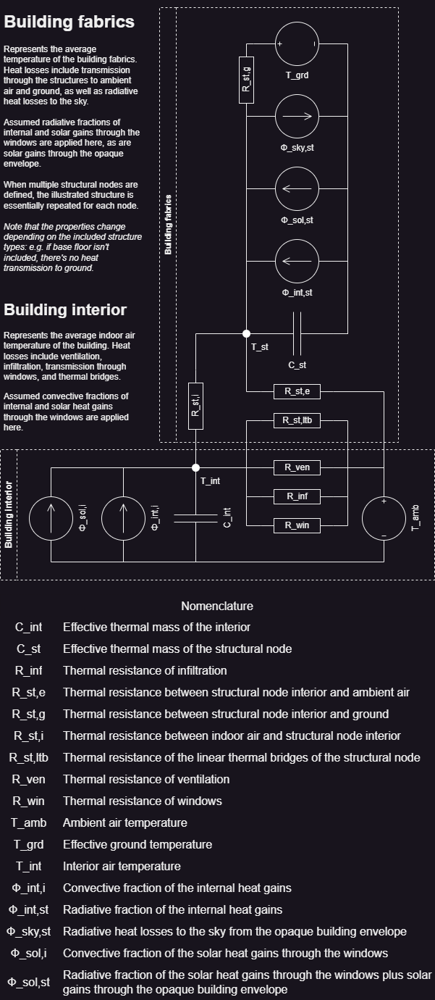

# Archetype building modelling

This section aims to explain the lumped-capacitance *(resistance-capacitance)*
modelling approach and the inherent assumptions used by this module in more detail,
aimed at a more expert audience interested in the inner workings of the module.
However, a lot of the techical details are not reproduced here,
but instead reference the relevant docstrings in the [Library](@ref) section.
In general, the used method is loosely based on the international standard
[EN ISO 52016-1:2017](https://www.iso.org/obp/ui/#iso:std:iso:52016:-1:ed-1:v1:en),
and majority of the same assumptions apply.

Overall, the structure of this section more or less follows the
[`ArchetypeBuilding`](@ref) constructor,
as it is the key struct containing and calculating all the information 
necessary for modelling an archetype building.
The [Process `ScopeData` structs](@ref), [Process `WeatherData` structs](@ref),
and [ArchetypeBuildingWeather.py](@ref) sections already sufficiently explain
the handling of the building stock statistics and weather data as input,
so we'll start with [Forming the building envelope](@ref) instead.
Next, we proceed to [Preparing the building loads](@ref),
namely the internal heat gains and solar heat gains for the archetype building.
Then, now that we know the dimensions of the building envelope and the
external loads on the building, we can proceed with
[Calculating the properties of the lumped-capacitance thermal nodes](@ref),
as well as with [Calculating the properties of the HVAC equipment](@ref).
Finally, `ArchetypeBuildingModel.jl` also includes a very simple rule-based
method for [Solving the baseline heating demand and HVAC equipment consumption](@ref).
While the main goal of this module is to provide input data for optimization
models like [Backbone](https://cris.vtt.fi/en/publications/backbone) or
[SpineOpt](https://github.com/Spine-project/SpineOpt.jl),
having access to simple standalone baseline solutions is a quite helpful.

## Forming the building envelope

The first step in creating an archetype building is forming the building
envelope by calculating the dimensions of the different structures,
and storing the results in a corresponding [`EnvelopeData`](@ref) struct.
However, as `ArchetypeBuildingModel.jl` aims to remain useable on the building
stock scale, the geometry of the archetype buildings is heavily simplified.
The key assumptions for forming the archetype building envelope are as follows:

- **The archetype buildings are assumed to be rectangular in shape, with an `average_gross_floor_area_m2_per_building` based on the appropriate [`ScopeData`](@ref).** The shape of the envelope is assumed to be primarily determined by the following [building\_archetype](@ref) parameters:
    - [number\_of\_storeys](@ref): The assumed average number of storeys of the archetype building. In case of non-integer values, only the topmost separating floor is assumed to differ from the rest. Essentially, the `average_gross_floor_area_m2_per_building` is divided into this many floors.
    - [building\_frame\_depth\_m](@ref): The assumed average depth of the archetype building. Since dwellings typically have requirements for natural light *(at least in Finland)*, there's a limit for how deep the building frame can reasonably be when fenestrated from both sides. Naturally, this varies from building to building depending on their age and exact shape, but in general, I find it more reliable than using e.g. some assumption about the width-to-depth ratio of the buildings.
    - [room\_height\_m](@ref): The assumed average height of the rooms. In combination with the [number\_of\_storeys](@ref), this parameter determines how tall the archetype buildings are. For simplicity, all storeys are assumed to be equally high, and non-integer [number\_of\_storeys](@ref) are rounded up for estimating the height of the building.

- Fenestration and partition walls are controlled using the following parameters:
    - [partition\_wall\_length\_ratio\_to\_external\_walls\_m\_m](@ref) controls the amount of partition walls relative to external walls.
    - [window\_area\_distribution\_towards\_cardinal\_directions](@ref) controls the facing of windows *(North, East, South, West, Horizontal)*.
    - [window\_area\_to\_external\_wall\_ratio\_m2\_m2](@ref) controls the share of windows relative to vertical facade area.

See the [`ArchetypeBuildingModel.process_building_envelope`](@ref) docstring
for a detailed explanation of how the envelope shape related parameters
affect the calculations.
The actual equations for the surface areas and linear thermal
bridge lengths of the structures can be found from the docstrings of the
dedicated functions linked therein.

## Preparing the building loads

The next step we need to do before we can really start forming
the lumped-capacitance thermal nodes is to determine the total external heat
loads for the archetype building.
Essentially, this means forming the [`LoadsData`](@ref) struct,
containing the total domestic hot water demand, internal heat gains,
as well as solar heat gains for the building.

The total building loads for the [`LoadsData`](@ref) are calculated by the
[`ArchetypeBuildingModel.process_building_loads`](@ref) function,
based on the input data provided via the connected [building\_loads](@ref) object.
The calculations for the total domestic hot water demand and internal gains
are extremely simple, and essentially only boil down to adding together
the prodived `base` and `gfa_scaling` input data.
See the [`ArchetypeBuildingModel.calculate_total_dhw_demand`](@ref)
and [`ArchetypeBuildingModel.calculate_total_internal_heat_loads`](@ref)
for the exact formulations.

Calculating the total solar gains for the buildings is more complicated,
but it is still heavily simplified by the following key assumptions in line with the 
[EN ISO 52016-1:2017](https://www.iso.org/obp/ui/#iso:std:iso:52016:-1:ed-1:v1:en) standard:

- **Solar properties of windows as well as external shading are assumed to be independent of the solar angle.**
- **Surface heat transfer coefficients and apparent sky to ambient air temperature difference are approximated as time-invariant averages.**
- **Exterior surface of envelope structures is assumed to have negligible thermal mass for simplicity.**
- **For the purpose of solar heat gains, the building is assumed to aligned with the cardinal directions.**

Solar gains through the windows are impacted by the window properties in
[`ScopeData`](@ref), the solar irradiation in [`WeatherData`](@ref),
the assumed [window\_non\_perpendicularity\_correction\_factor](@ref),
as well as the estimated [external\_shading\_coefficient](@ref) and
[window\_area\_distribution\_towards\_cardinal\_directions](@ref).
See the [`ArchetypeBuildingModel.calculate_total_solar_gains`](@ref)
for the exact formulation.

Meanwhile, the solar gains through the building envelope are impacted by the
[exterior\_resistance\_m2K\_W](@ref) and [external\_U\_value\_to\_ambient\_air\_W\_m2K](@ref)
of each structure, their surface areas as recored in [`EnvelopeData`](@ref),
The assumed [average\_structural\_solar\_absorption\_coefficient](@ref),
the solar irradiation in [`WeatherData`](@ref),
as well as the estimated [external\_shading\_coefficient](@ref).
The radiative envelope sky heat losses are also heavily simplified,
depending again on the surface properties of the structures,
as well as assumed sky view factors,
the assumed [external\_radiative\_surface\_heat\_transfer\_coefficient\_W\_m2K](@ref),
and the assumed [average\_apparent\_sky\_temperature\_difference\_K](@ref).
See the [`ArchetypeBuildingModel.calculate_total_envelope_solar_gains`](@ref)
and [`ArchetypeBuildingModel.calculate_total_envelope_radiative_sky_losses`](@ref),
as well as the functions linked therein for the exact formulation.

## Calculating the properties of the lumped-capacitance thermal nodes

Now that we have the processed [`EnvelopeData`](@ref) and [`LoadsData`](@ref),
we can finally start calculating the properties of the lumped-capacitance
thermal nodes in earnest.
First, the [`create_building_node_network`](@ref) function is called to form
the [`ArchetypeBuildingModel.BuildingNodeNetwork`](@ref),
which is essentially a dictionary containing
the processed [`BuildingNodeData`](@ref) of all the relevant thermal nodes.
However, it's actually the [`BuildingNodeData`](@ref) and the
[`ArchetypeBuildingModel.process_building_node`](@ref) that are of primary
interest, as they contain and calculate the properties of the thermal nodes.

Because the [`BuildingNodeData`](@ref) has quite a few fields and the
[`ArchetypeBuildingModel.process_building_node`](@ref) has quite a few steps,
we won't be going through them thoroughly here.
Instead, we'll focus on the idea behind the thermal node processing,
hopefully giving you an understanding as to why and how the thermal nodes
are processed the way they are.
The processing of the thermal nodes relies entirely on
[The `building_node` definition](@ref), as it contains the information about
which [structure\_type](@ref)s are included in the node,
whether the node represents the interior air
*(via the [interior\_air\_and\_furniture\_weight](@ref) parameter)*,
or domestic hot water demand
*(via the [domestic\_hot\_water\_demand\_weight](@ref) parameter)*.
The procedure for calculating the properties of each lumped-capacitance thermal
node goes something like this:

1. Calculate the total effective thermal mass of this node by summing the effective thermal masses of the included structures and/or interior air and furniture.
    - The interior air node uses the [effective\_thermal\_capacity\_of\_interior\_air\_and\_furniture\_J\_m2K](@ref) parameter to estimate the impact of interior air and furniture.
2. Calculate the total heat transfer coefficient between this node and the interior air node based on the properties and dimensions of the included structures.
    - Relevant for structural nodes only.
3. Calculate the total heat transfer coefficient between this node and the ambient air and/or ground.
    - For structural nodes, this is again based on the properties and dimensions of the included structures.
    - For the interior air node, this is includes the impact of windows, ventilation and infiltration, and thermal bridges.
4. Calculate the total heat gains on this node, including internal and solar heat gains.
    - The assumed convective fraction of the heat gains are applied to the interior air node, while the assumed radiative fraction of the heat gains are distributed among the structural nodes based on their relative total structural surface areas.
    - Domestic hot water demand is applied as a "negative heat gain" on the domestic hot water node.

There are a few important simplifications in the above [`BuildingNodeData`](@ref) processing:
 - **Windows are treated separate from the rest of the structures, assumed to have negligible thermal mass, and act as a direct thermal resistance between the interior air and ambient air nodes.**
 - **The structural nodes don't interact with each other directly, only via the interior air node.**
     - Essentially, there's no approximation for heat transfer at the junctions of the different structures, nor for the radiative heat transfer between structures.
 - **Thermal bridges are assumed to bypass the structural nodes entirely.** Thus, their contribution is included in the heat transfer coefficient between the interior air node and the ambient air node.
     - In principle, it would be possible to split the effect of the thermal bridges between the interior and exterior heat transfer coefficients of the structural nodes. However, treating them separately in this manner is simpler.

For readers interested in the technical details and exact formulations,
please refer to the documentation of the
[`ArchetypeBuildingModel.process_building_node`](@ref) function,
and the functions linked therein.
See the [Processing thermal nodes into `AbstractNode`s](@ref) section for
how the data is adapted for use with large-scale energy system models,
which also happens to simplify
[Solving the baseline heating demand and HVAC equipment consumption](@ref).
Ultimately, the end result will look something like this:

## Calculating the properties of the HVAC equipment

The properties of the HVAC equipment are based on
[The `building_process` definition](@ref), and processed into [`BuildingProcessData`](@ref).
Overall, the process is pretty simple, roughly consisting of the following steps:

1. Fetch the user-defined properties of the HVAC equipment, most important of which are the input/output capacities.
2. Calculate the potentially weather-dependent coefficient of performance.

For the exact formulations, see the documentation for the
[`ArchetypeBuildingModel.process_building_system`](@ref) function and the
functions linked therein.
See the [Processing HVAC equipment into `AbstractProcess`es](@ref) section for
how the data is adapted for use with large-scale energy system models,
which also happens to simplify
[Solving the baseline heating demand and HVAC equipment consumption](@ref).

## Solving the baseline heating demand and HVAC equipment consumption

While the main goal of `ArchetypeBuildingModel.jl` is the creation of the
lumped-capacitance thermal models depicting the aggregated flexible
heating/cooling demand of building stocks,
it is often useful or even necessary to have a baseline heating/cooling
demand available for comparison.
As such, `ArchetypeBuildingModel.jl` includes a very simple rule-based
simulation of heating and cooling of the created [`ArchetypeBuilding`](@ref)s.

Storing and processing the heating/cooling demand and HVAC equipment energy
consumption results are handled via the [`ArchetypeBuildingResults`](@ref)
struct.
The actual calculations are performed in two main steps:

1. Solve initial temperatures *(unless explicitly provided)*, node temperatures, and nodal HVAC demand using the [`ArchetypeBuildingModel.solve_heating_demand`](@ref) function.
2. Solve the HVAC equipment consumption per process based on the above nodal demands using the [`ArchetypeBuildingModel.solve_consumption`](@ref) function.

For readers interested in the actual implementation and technical details,
please refer to the documentation of the above functions,
and the functions linked therein.
However, there are a few things worth noting about how the heating/cooling demand
and HVAC equipment consumption are solved:

 - **If not explicitly provided, lumped-capacitance thermal node initial temperatures are solved by starting the temperatures at their lowest permitted temperatures, and repeatedly solving the first 24-hours and replacing the initial temperatures with the ones on hour 24 until the temperatures no longer change.**
 - **The simulation of the heating/cooling demand uses implicit Euler discretization of the lumped-capacitance thermal node energy balance equations.**
     - This is mainly done to conform with the energy balance equations of [Backbone](https://cris.vtt.fi/en/publications/backbone) and [SpineOpt](https://github.com/Spine-project/SpineOpt.jl), as they both also use implicit Euler discretization for their energy balance constraints.
 - **The simple rule-based controller used in determining the heating/cooling demand for the lumped-capacitance thermal nodes has the following rules:**
     - If the temperature of a node would increase above its permitted maximum temperature, provide just enough cooling to keep it at the maximum.
     - If the temperature of a node would fall below its permitted minimum, provide just enough heating to keep it at the minimum.
 - **The nodal heating/cooling demand is used as-is for every [building\_process](@ref) for determining the HVAC equipment energy consumption, regardless of potential capacity limitations.**
     - Essentially, when calculating the baseline HVAC equipment energy consumption, we assume that every process handles the entirety of the heating/cooling load.
     - For most simple use-cases, this is fine. However, if there are e.g. multiple parallel heating or cooling processes on a node, the calculated baseline HVAC consumption isn't useful as-is. In such cases, the user needs to combine the HVAC consumption time series themselves, based on assumed operation logic of the parallel heating/cooling systems.