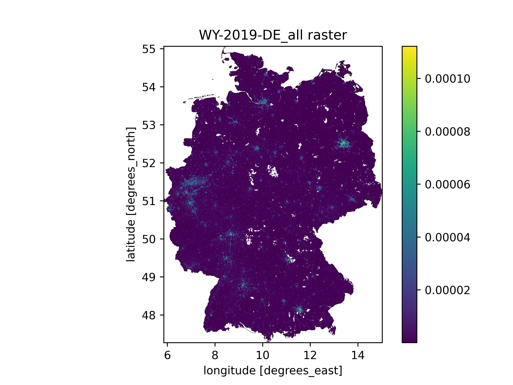
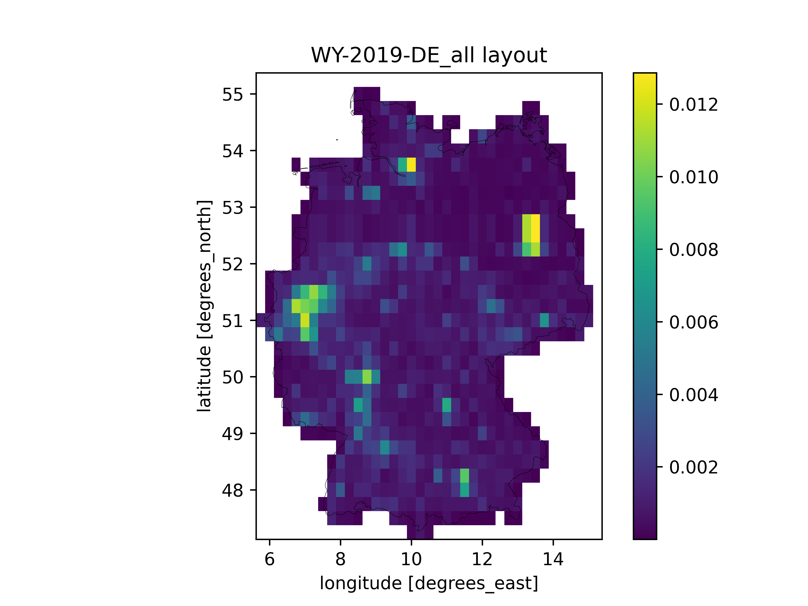

# ArchetypeBuildingWeather.py

A [`PyPSA/atlite`](https://github.com/PyPSA/atlite)-based Python sub-module for processing weather data.

The aim of this sub-module is to automatically aggregate ERA5 weather data
for large geographical areas described using a shapefile,
a set of weights connected to the shapefile,
and an optional raster data file also used for weighting.
Since the Julia documenter doesn't know how to automatically handle Python
docstrings, interested readers unfortunately need to look into the code itself
for the technical details.
However, the following sections hope to at least give you a rough idea about what
the `ArchetypeBuildingWeather.py` sub-module does.
Furthermore, the `testscript.ipynb` *Jupyter Notebook* included in this
repository provides and example how the weather data aggregation works.


## Contents

```@contents
Pages = ["archetypebuildingweather.md"]
```


## Input data requirements for the automatic weather data aggregation

The weather data aggregation is controlled by a few parameters in the 
[Input data reference](@ref):
- [shapefile\_path](@ref): Filepath pointing to a shapefile describing the geographical shape of the [building\_stock](@ref) in question.
- [weather\_year](@ref): The desired weather year for the [building\_archetype](@ref).
- [raster\_weight\_path](@ref): An optional filepath to weighting raster data.

While the [weather\_year](@ref) is more or less self-explanatory,
there are a few important things to know about the shapefile and optional
raster data:
- The shapefile and raster must use the *WGS 84 EPSG:4326* coordinate reference system, as it is required by `PyPSA/atlite` for correctly handling *ERA5* data.
- The shapefile must contain an attribute called `location`, with values corresponding to the [location\_id](@ref) *objects (not the [location\_name](@ref) parameters!)* for the included polygons. E.g. for my Finnish building stock data, I have a `FI.shp` containing a polygon for each municipality in Finland, with the `location` attribute containing the Finnish municipality code for each polygon.
- The absolute values of the optional raster data *don't matter*, as the data is normalized during the processing.


## High-level description of the weather data aggregation, the `aggregate_weather` function

As explained by the [Process `WeatherData` structs](@ref) section,
if [The `building_archetype` definition](@ref) doesn't include a user-specified
[building\_weather](@ref) definition, the [`create_building_weather`](@ref)
function is called to attempt to automatically fetch and aggregate the desired
weather data based on [The `building_scope` definition](@ref).
Under the hood, the [`create_building_weather`](@ref) calls the
`aggregate_weather` Python function, which could be called the *main function*
of the `ArchetypeBuildingWeather.py` sub-module. The `aggregate_weather` function
essentially performs the following steps:

1. Load the shapefile from [shapefile\_path].
2. Prepare the `cutout` for `atlite` using [The `prepare_cutout` function](@ref).
3. Prepare the `layout` for `atlite` using [The `prepare_layout` function](@ref).
4. Match the `layout` to the ERA5 resolution using [The `match_layout` function](@ref).
5. If `save_layouts == true`, plot diagnostics using [The `plot_layout` function](@ref).
6. Return the output of [The `process_weather` function](@ref).


### The `prepare_cutout` function

The `prepare_cutout` function takes as input the given `shapefile` and
`weather_year`, and quite simply creates and prepares the `atlite` ERA5 cutout.
See the [`atlite` documentation](https://atlite.readthedocs.io/en/latest/introduction.html)
or their [*Creating a Cutout with ERA5* example](https://atlite.readthedocs.io/en/latest/examples/create_cutout.html) for more information.


### The `prepare_layout` function

The `prepare_layout` function takes the given `shapefile`, the optional
`raster_path`, as well as the `location_id_gfa_weights` produced by the
[`ArchetypeBuildingModel.process_building_stock_scope`](@ref) function,
and produces a `layout` raster for sampling the ERA5 weather data. Again, see the
[`atlite` documentation](https://atlite.readthedocs.io/en/latest/introduction.html)
for more information. The `layout` produced here is essentially identical to
the *capacity layouts* described in the documentation, except that ours is
normalized so that it results into a weighted average value,
instead of a cumulative value.

**NOTE!** The `location_id_gfa_weights` have precedence over the optional
`raster_path` weights. When both are used, the raster weights are normalized
to match the corresponding `location_id_gfa_weights`, which are based on the
`shapefile` vector GIS data. Thus, the `raster_path` is essentially only used
to refine the distribution *inside* the `location_id` polygons of the `shapefile`.


### The `match_layout` function

Typically, [The `prepare_layout` function](@ref) results in a weight raster
with a significantly better geographical resolution than the ERA5 weather data.
Thus, the `match_layout` function is used to match the resolution of the `layout`
to the ERA5 data. By default, this is done by averaging all the data inside each
ERA5 pixel, but this can be changed to summation of desired. Finally,
the reindexed `layout` is normalized to ensure weighted averaging of the weather
data.


### The `plot_layout` function

If the `save_layouts == true` *(true by default)* is set, the `plot_layout`
function is called to plot both the `layout` both with its original resolution,
as well as after [The `match_layout` function](@ref) has been called.
The diagnostic figures are saved under the `figs/` folder in the repository.
Here are example weather data aggregation `layouts` for Germany as plotted by
the `plot_layout` function, before and after matching the used polulation density
raster resolution to ERA5.





### The `process_weather` function

After both the `cutout` and the `layout` have been processed,
the `process_weather` function is called to calculate the aggregated weather
parameters required for the `ArchetypeBuildingModel.jl`. Essentially,
this means calculating the following:
1. Ambient temperature in [K].
2. Diffuse irradiation on a horizontal surface in [W/m2].
3. Direct irradiation on vertical surfaces facing in the cardinal directions in [W/m2].

So ultimately, out of all this weather data processing,
we're left with only six timeseries representing the weighted average weather
over the [building\_scope](@ref).