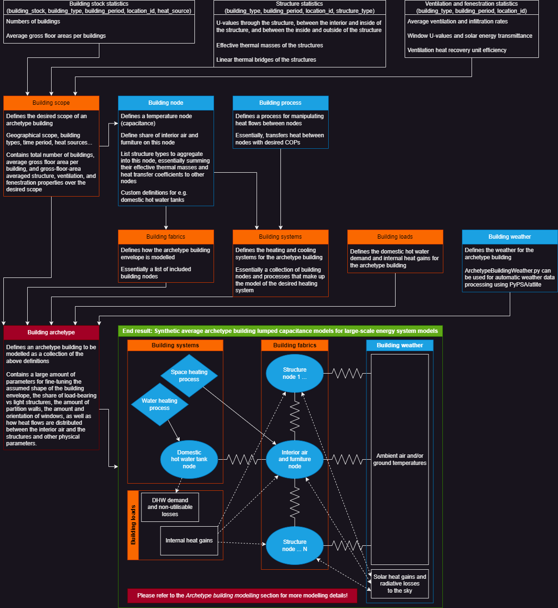

# ArBuMo.jl

A [SpineInterface.jl](https://github.com/Spine-project/SpineInterface.jl)-based
Julia module for aggregating building stock data into desired
archetype building lumped-capacitance thermal models.

The goal of this module is to provide an easy way to define and aggregate
building stock statistical data into arbitrary sets of synthetic average
archetype building lumped-capacitance thermal models, depicting the flexible
heating/cooling demand of a building stock.
These lumped-capacitance thermal models are created primarily for
seamless integration into large-scale energy system models like
[Backbone](https://cris.vtt.fi/en/publications/backbone) or
[SpineOpt](https://github.com/Spine-project/SpineOpt.jl),
in order to depict flexible heating/cooling demand of significant portions
of the building stock.

Essentially, this module takes input data and archetype building definitions
in the format detailed in the [Input data reference](@ref)
section as input, processes them according to the workflow detailed in the
[Overview of the workflow](@ref) section, and produces
lumped-capacitance thermal models of the desired synthetic average archetype
buildings depicting the heating/cooling demand and HVAC energy consumption
of a building stock, explained in the [Archetype building modelling](@ref) section.
While weather data can be provided by the user if desired,
the [ArchetypeBuildingWeather.py](@ref) python sub-module provides automatic
fetching and processing of the necessary weather data based on the provided
archetype building definitions.
[Solving the baseline heating demand and HVAC equipment consumption](@ref)
is also calculated using very simple rule-based control keeping the node
temperatures within permitted limits.

The key outputs from this module, however, are the readily made
[Backbone](https://cris.vtt.fi/en/publications/backbone) or
[SpineOpt](https://github.com/Spine-project/SpineOpt.jl) input datasets
that can be plugged into their respective energy system models for
depicting the flexible heating/cooling demand of the depicted building stock.
See the figure below for a high-level illustration of the workflow.

This documentation is organized as follows:
The [Defining archetype buildings](@ref) section explains how the archetype
buildings are defined, meaning the key components in the
[Input data reference](@ref), and how to use them.
The [Overview of the workflow](@ref) section goes through the
`process_archetype_buildings.jl` main program file, explaining what is
actually being done when aggregating the building stock data into the
desired synthetic average archetype buildings.
The [Archetype building modelling](@ref) section explains the lumped-capacitance
thermal modelling approach used by this module in more detail,
while the [ArchetypeBuildingWeather.py](@ref) section briefly explains
the logic and workings of the python sub-module handling the automatic
weather data processing.
The [Input data processing for large-scale energy system modelling frameworks](@ref)
section provides an overview of how the data is further processed to be compatible
with [Backbone](https://cris.vtt.fi/en/publications/backbone)
and [SpineOpt](https://github.com/Spine-project/SpineOpt.jl).
Finally, the [Input data reference](@ref) and the [Library](@ref)
sections provide comprehensive documentation of the definition/input
data format and the modelling code respectively.




## Key limitations

Due to the used simplified modelling approach, there are several key limitations for the model that users should be aware of:

1. **ArBuMo.jl primarily aims to depict the *flexibility* in building stock heating/cooling demand, and *NOT* the demand itself.** While the model produces baseline heating and cooling demand timeseries, it is important to understand that these timeseries are oversimplified compared to the actual demand. Due to the limited number of archetype buildings and the used single-zone approach, there can be relatively long periods where, *on average*, the model requires no heating and cooling at all. In reality, it is all but guaranteed that there will always be some buildings *(or zones therein)* requiring at least some cooling and/or heating at any given time.

2. **Heating and cooling set points can currently only be provided as constants, which can have a major impact on the modelled heating/cooling flexibility.** In some places, it is common to significantly reduce heating when buildings are unoccupied in order to save energy. While such boundaries would pose no problems for the intended use in large-scale energy system optimisation models, the simple rule-based controller currently used for calculating the baseline heating/cooling demand cannot handle changing set points.

3. **Several real-life phenomena affecting the heating/cooling demand are neglected for simplicity:**
    - Temperature-dependent bypass of ventilation heat recovery units (HRUs). In reality, HRUs can be bypassed in summer to reduce cooling loads, but implementing these types of controls compatible with mixed-integer linear programming frameworks is not straightforward. Likely results in overestimated cooling flexibility.
    - Potential opening of doors/windows for additional ventilation or cooling by the inhabitants, likely resulting in overestimated cooling demand flexibility.
    - Potential use of active solar shading elements in buildings, e.g. blinds, for reducing solar heat gains in summer to reduce cooling loads. Likely results in overestimated cooling demand.
    - Potential change in inhabitant behaviour to increase/reduce internal heat gains depending on indoor air temperature.


## Related works

For an up-to-date list of works using [ArBuMo.jl](@ref),
please refer to the
[VTT Research Information System entry on ArBuMo.jl](https://cris.vtt.fi/en/publications/archetypebuildingmodeljl-a-julia-module-for-aggregating-building-).
Regardless, here are a couple of author-curated highlights:

1. [Sensitivity analysis and comparison against dedicated white-box building simulation software (Preprint)](https://zenodo.org/doi/10.5281/zenodo.7623739)
2. [Building-level optimal energy management (Preprint)](https://zenodo.org/doi/10.5281/zenodo.7767363)
3. [Stochastic district-level energy management (Accepted and presented at the BS2023 conference, yet to be published)](https://cris.vtt.fi/en/publications/stochastic-model-predictive-control-of-district-scale-building-en)
4. [Demo for generating EU-level flexible building stock heating/cooling models for SpineOpt](https://zenodo.org/doi/10.5281/zenodo.8238141)
5. [Analysing the impacts of flexible residential electric heating for Finland (MSc thesis)](https://cris.vtt.fi/en/publications/heating-demand-response-in-detached-houses-comparing-cost-savings)


## Future work?

Overall, I'm beginning to feel that *ArBuMo.jl* is too
complicated to be truly useful, and different simplifications are required.
Instead, it might be worthwhile to try an approach where the heating
and cooling demand are separated from the depiction of the *flexibility*,
as this would offer two key advantages:

1. **Modularity:** If the calculation of the heating/cooling demand of the modelled building stock could be separated from how the flexibility is depicted, it would allow easy swapping between different models for calculating the heating/cooling demand.

2. **Accuracy?** If the heating/cooling demand is separated from the flexibility, it should allow more accurate depictions of aggregated heating/cooling demand, mitigating point 1 in [Key limitations](@ref).

Essentially, the flexibility in heating/cooling demand could maybe be represented
as a storage of the *deviation* from the baseline heating/cooling demand.
At least two storage nodes would probably still be necessary to accurately
capture short-term flexibility due to the faster response of indoor air
temperatures to any changes in heating/cooling power, acting as a buffer
between energy in and the heating/cooling demand.
However, there are some foreseeable challenges with such an approach:

1. **Accuracy?** Even if the heating/cooling demand could be depicted more accurately, it is possible that depicting flexibility becomes more challenging requiring simplifications affecting the modelled accuracy. Can time-varying ambient or indoor conditions be properly accounted for?

2. **Heating vs cooling demand?** Can heating and cooling demand be properly captured if the flexibility if modelled as a *storage for temperature deviation*?

So who knows if such an approach would be any more worthwhile?


## Contents

```@contents
```